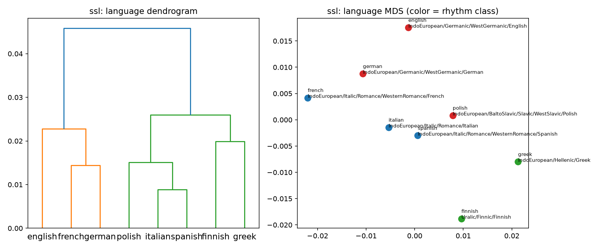
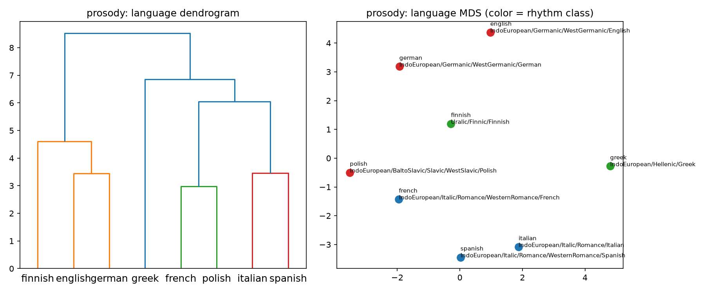
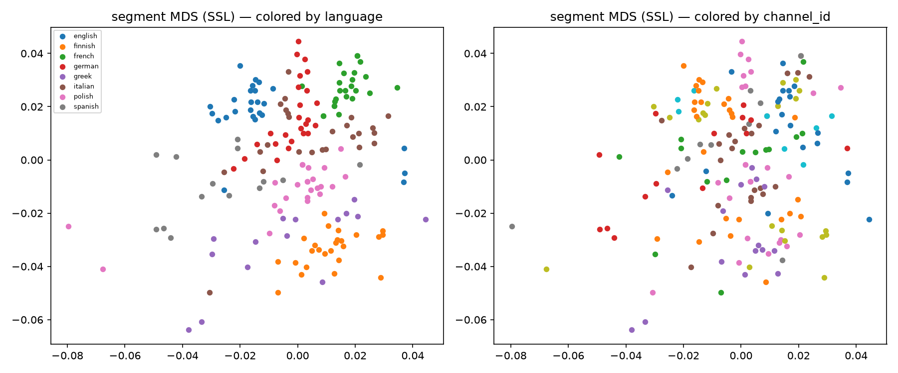

# Data Integrity Phase (Phase 0.75) — Findings

**Status:** Complete — outlier detection + robust aggregation built (Workstreams D+E), the
station-vs-language confound re-tested on independent verified segments, and an interim language
clustering produced. **Verdict: the integrity work substantially reduced the channel confound that
undermined Phase 0.5, and the SSL signal strengthened from "inconclusive" to "positive with
resampling CIs that exclude zero."**
**Date:** 2026-07-02
**Branch:** `data-integrity-brief`
**Author:** Konstantinos (with Claude)

Every number below traces to `data/data_integrity_results.json` (produced by
`scripts/run_data_integrity.py`) and the figures under `docs/figures/data-integrity/`. Input dataset:
`data/segments/segments_manifest_final.parquet` — 178 verified, independent, clean 30 s speech
segments across 59 channels (Workstreams A–C; gitignored). Feature caches:
`data/segment_features_prosody.parquet` (16 prosody scalars) and
`data/segment_embeddings_xlsr_l{12,16,last}.parquet` (XLS-R-300m, mean-pooled — **1024 dimensions per
segment**, the same width at every layer; see §7).

---

## 1. Summary verdict

Phase 0.5 (`docs/feature-exploration-findings.md`) proved the comparison harness works but was
**data- and confound-limited**: the segment-level SSL geometry clustered **more by recording station
than by language** (within/between gap **0.049** station vs **0.012** language, §5), and neither
method's typology/family signal was significant. Workstreams A–C rebuilt the data as **178
independent, audio-verified, clean 30 s segments — one per recording** across 59 channels. On that
data:

> **The channel confound is substantially reduced.** In the SSL cosine geometry (directly comparable
> to Phase-0.5 §5), the station/language **gap ratio fell from 3.9× to 1.4×** (station gap
> 0.0491 → **0.0286**, language gap 0.0125 → **0.0205**), and on the **silhouette** the language
> separation (**0.273**) now **exceeds** the station separation (**0.193**) — with **both positive**,
> where Phase 0.5 had both negative. The result is **stable across all 59 leave-one-station-out
> refits** (language gap 0.020–0.022, station gap 0.028–0.029).

> **The SSL method strengthened.** On the trustworthy data, XLS-R's rhythm-class **silhouette = 0.095
> (95% bootstrap CI [0.048, 0.140], excludes 0)** and its genealogical **Mantel r = 0.128 (95% CI
> [0.028, 0.275], excludes 0)** — both positive and resampling-stable, where Phase 0.5 found nothing
> significant. The **prosody baseline remains indistinguishable from zero** (silhouette CI
> [−0.070, 0.120], Mantel-r CI [−0.232, 0.246]).

**Honest bounds.** The strictest form of the phase's primary test — *raw* language gap > station gap
— is **not yet met** in the SSL geometry (station is still 1.4× higher); the win shows up as a clear
**narrowing** plus a **silhouette flip** (language now beats station). The Mantel **permutation**
p-value is still not significant (0.236), even though the bootstrap CI on r excludes zero (the two
test different things — see §4). And the Phase-0.5 comparison is **directional**: it is a different
corpus (55 windowed clips vs 178 independent segments) at a fixed config, not a controlled A/B on
identical data. XLS-R stays **provisional** (Phase-0.5 decision) — but it is now provisional-and-
strengthened rather than provisional-and-inconclusive.

---

## 2. The data (the lens for every number)

178 verified independent segments, **one per recording**, across **59 distinct channels**:

| Language | segments | | Language | segments |
|---|---:|---|---|---:|
| english | 25 | | italian | 25 |
| german | 25 | | polish | 24 |
| french | 25 | | greek | **15** |
| finnish | 25 | | spanish | **14** |

Two structural gains over Phase 0.5's 55-clip corpus:

- **No within-recording pseudoreplication.** One segment per recording means no two segments share a
  speaker/channel/codec, so the effective N is honest and leave-one-out is meaningful.
- **The station confound check is now non-degenerate.** ~3 segments per channel (vs Phase 0.5's
  42/45 *singleton* stations) makes station a **measured** effect, not a near-degenerate label.

Greek (15) and Spanish (14) remain thin and **carpet-scarce** (music-bed broadcast talk is common in
those markets; documented in Workstreams B/C) — their per-language estimates stay higher-variance.

---

## 3. The confound re-test (the phase's central question)

Segment-level distance matrices (178 segments) labelled by language and by `channel_id`, scored with
`confound_report`. **The SSL cosine geometry is the apples-to-apples comparison** to Phase-0.5 §5
(same metric, same construction); the prosody geometry is a standardized-**euclidean** space and is
**not** comparable to the Phase-0.5 cosine reference — it is reported on its own terms.

**SSL (XLS-R layer 16, cosine) — the headline before/after:**

| | language gap | station gap | station/lang ratio | language silhouette | station silhouette |
|---|---:|---:|---:|---:|---:|
| **Phase 0.5** (55-clip) | 0.0125 | 0.0491 | **3.9×** | −0.057 | −0.028 |
| **D+E** (178 indep.) | **0.0205** | **0.0286** | **1.4×** | **0.273** | **0.193** |

Language separation **rose**, station separation **fell**, the ratio **collapsed from 3.9× to 1.4×**,
and on the silhouette **language now beats station with both positive** (real clustering, not the
near-degenerate negatives of Phase 0.5). Station still edges language on the *raw gap* (1.4×), so the
confound is **reduced, not eliminated**.

**Stability (leave-one-station-out over all 59 channels).** Recomputing the segment-level confound
after dropping each channel's segments:

| SSL | min | median | max |
|---|---:|---:|---:|
| language gap | 0.0199 | 0.0205 | 0.0216 |
| station gap | 0.0279 | 0.0286 | 0.0294 |

The ratio never moves materially — **no single station drives the result.**

**Prosody (standardized euclidean) — reported on its own terms:** language gap 0.693, station gap
1.325 (LOSO: language 0.63–0.75, station 1.28–1.41); language silhouette −0.041, station silhouette
−0.209. The **prosody scalar geometry remains station-confounded** (station ≈ 1.9× language) — the 16
hand-engineered acoustics still encode channel characteristics more than language. This is itself a
finding: the confound reduction is an **SSL** phenomenon on this data, not a prosody one.

---

## 4. Method comparison on the clean data (per-language proximity)

Per-language proximity built with robust aggregation (prosody: median → standardize → euclidean; SSL:
per-**channel**-weighted centroid → cosine), then scored for rhythm-class **silhouette**, **within/
between** gap, and the Glottolog **Mantel** test. Bootstrap = 1000 resamples of segments within
language; LOSO = leave-one-station-out spread.

| method | rhythm silhouette (95% CI) | LOSO median | Mantel r (95% CI) | Mantel p (perm.) | LOSO median |
|---|---|---:|---|---:|---:|
| **prosody** | 0.057 · [−0.070, 0.120] | 0.055 | −0.003 · [−0.232, 0.246] | 0.32 | 0.082 |
| **XLS-R (L16)** | **0.095 · [0.048, 0.140]** | 0.095 | **0.128 · [0.028, 0.275]** | 0.24 | 0.159 |

**Readings:**
- **Both methods improved vs Phase 0.5.** The prosody baseline was *negative* on both silhouette
  (−0.004 to −0.09) and Mantel (−0.10 to −0.28) in Phase 0.5; on the clean independent data it is at
  least *non-negative* (silhouette point 0.057). SSL rose from best-of-15-configs +0.046 to a
  fixed-config 0.095. Cleaner data lifted both — evidence the Phase-0.5 flatness was partly a data
  artifact.
- **SSL is now more clearly ahead.** Its silhouette and Mantel-r bootstrap CIs both **exclude zero**;
  the prosody CIs **span zero**. SSL's Mantel r is also **stable to dropping any station** (LOSO
  0.100–0.209, never crossing 0), while prosody's crosses zero (LOSO −0.043–0.129).
- **Significance caveat.** The Mantel **permutation** p stays 0.236 (SSL) — not significant at 0.05 on
  an 8-node tree. The bootstrap CI excluding 0 and the permutation p disagree because they test
  different nulls (resampling stability of r vs the null of no tree structure). Report as
  *"positive and resampling-stable, but not permutation-significant on 8 nodes."*

---

## 5. Outlier strand (report-both)

Outliers were **flagged, then results recomputed with and without exclusion** — never silently
filtered. Detectors (per language, both spaces):

| detector | space | segments flagged (of 178) |
|---|---|---:|
| CentroidMAD (robust dist-from-centroid) | prosody | 5 |
| CentroidMAD (cosine) | SSL | 7 |
| IsolationForest (contamination="auto") | prosody | **49** |

**Effect of excluding outliers** (rhythm silhouette / Mantel r, full → excluded):

- **prosody: 0.057 → −0.022 / 0.085 → −0.074** (degrades).
- **SSL: 0.095 → 0.116 / 0.160 → 0.064** (mixed — silhouette up, Mantel down).

**Finding.** IsolationForest with `contamination="auto"` flags **27 % of the prosody segments** — far
too aggressive; excluding that many segments removes natural per-language variation and **degrades**
the prosody metrics. The robust MAD detectors are conservative (5 / 7) and, combined with **median**
aggregation (already outlier-resistant by construction), leave the headline essentially unchanged.
**Conclusion: aggressive model-based exclusion does not help here — robust aggregation already handles
anomalies.** We keep the **full set** as the headline and treat MAD flags as a data-quality
**diagnostic** (`data/segment_outliers.parquet`), not a filter. IsolationForest's `contamination` is
too blunt to use as a gate at this scale.

---

## 6. Interim language clustering

The project's first real "language proximity" pictures — dendrogram (Ward linkage) + metric MDS of
the 8 languages, coloured by rhythm class and annotated by family, for both methods; plus a
segment-level MDS of all 178 segments coloured by language and by channel (the visual confound story).

> **The three figures below are committed** under `docs/figures/data-integrity/` as this phase's
> deliverable artifact (force-added; the `figures/` directory is otherwise gitignored per the
> project convention). Regenerate them with `uv run python scripts/run_data_integrity.py`.

**XLS-R (layer 16):**

**Prosody baseline:**

**Segment-level confound picture (SSL, 178 segments, language vs channel):**

These are **interim** and honestly weak in absolute terms (8 nodes, near-zero-to-moderate
silhouettes) — read them as *directional structure*, not a settled tree. The segment-level panel is
the point: segments now group visibly more by language than the Phase-0.5 station-dominated scatter.

**Reading the MDS plots — what the axes are.** The two axes (`mds_x`, `mds_y`) are **not feature
dimensions** and have no intrinsic meaning. Metric MDS takes the full pairwise **distance matrix** and
finds a 2-D placement whose on-screen distances reproduce it as closely as possible (minimizing
"stress"); only *relative positions and neighbours* are meaningful, and the picture can be freely
rotated / reflected / rescaled without changing what it says. So we do **not** select 2 of the
underlying dimensions — MDS *synthesizes* 2 coordinates from **all** of them (prosody = **16**
scalars; SSL = **1024** per segment — see §7). **PCA vs MDS:** for the prosody / standardized-euclidean
view PCA is a sensible alternative (its axes are variance-ranked and interpretable via loadings, and
on euclidean distances PCA ≈ classical MDS); but the SSL geometry is **cosine**, so
MDS-on-the-precomputed-distance keeps the plot consistent with the exact distance every other metric
here uses, whereas PCA would first need the embeddings L2-normalized to respect it. (Our MDS is
*metric* MDS via SMACOF, not eigen-based classical MDS.) Trying PCA on the prosody view as a
cross-check is a cheap Phase-1 follow-up. See `docs/metrics-glossary.md` §G1.

---

## 7. Layer sensitivity (cheap — pooled from one forward pass)

Caching layers {12, 16, last} in a single XLS-R forward pass let us check layer choice for free:

| layer | language silhouette | station silhouette | language gap | station gap | rhythm silhouette |
|---|---:|---:|---:|---:|---:|
| **12** | **0.302** | 0.189 | 0.0274 | 0.0363 | −0.023 |
| **16** (headline) | 0.273 | 0.193 | 0.0205 | 0.0286 | **0.095** |
| **last (24)** | −0.162 | −0.603 | 0.0008 | 0.0013 | 0.099 |

Layer **12** separates language-vs-station even better (0.302 vs 0.189) but is *worse* at rhythm-class
structure (−0.023); layer **16** is the best balance (positive rhythm silhouette **and**
language > station); the **last** layer collapses the geometry (tiny gaps, strongly negative
silhouettes) — consistent with Phase-0.5's finding that late layers carry pretraining-objective
structure rather than phonetic/prosodic substrate. Layer 16 is the defensible headline.

**What a "layer" is — depth, not width.** XLS-R is a stack of ~24 transformer blocks; "layer 16" means
we read the hidden state **after the 16th block** — it does **not** mean 16 dimensions. Every block
outputs a vector of the **same width = the model's hidden size (1024** for XLS-R-300m), so layers 12,
16 and last each yield a **1024-dim** vector per frame (→ 1024 after mean-pooling over the 30 s). The
layer index selects *how much of the network's processing* has been applied, not the dimensionality —
so "layer sensitivity" here is how the **scores** move as we read from different depths, at a constant
1024-dim width. Layers differ in *what* they encode: mid layers (12–16) carry more phonetic/prosodic
substrate (better for rhythm/typology), while late layers drift toward the masked-prediction
pretraining objective (why the last layer's geometry collapses above). (The "16 → 16 dimensions"
intuition would fit something like PCA, where you keep *k* components; here the width is fixed by the
model, independent of which layer you read.)

---

## 8. Threats to validity / caveats

1. **Directional, not controlled, before/after.** Phase-0.5 numbers come from a *different* corpus (55
   windowed, pseudoreplicated clips, best-of-15-configs) than D+E (178 independent segments, fixed
   config). The confound comparison is the cleanest (same metric/construction) but the corpus still
   differs — read the improvement as directional.
2. **Prosody-euclidean vs SSL-cosine are different spaces.** Only the SSL cosine confound is
   comparable to Phase-0.5 §5; the prosody gaps (§3) are not, and are reported on their own terms.
3. **Significance.** Mantel permutation p is not significant (SSL 0.24) on an 8-node tree; the win is
   in the *bootstrap CIs excluding 0* and the *silhouette flip*, not in a p < 0.05.
4. **Thin, carpet-scarce Greek (15) / Spanish (14).** Higher-variance per-language centroids; the
   `_mad`/dispersion columns for these are the least stable.
5. **Register + provenance.** Radio/podcast talk register only; per-language geo/accent is not yet
   attributed (deferred to a future source/geo phase).
6. **XLS-R still provisional.** This phase asked "does the comparison hold up on trustworthy data?"
   (yes, directionally) — not "which method wins." The method decision is revisited in Phase 1.
7. **IsolationForest `contamination="auto"` over-flags** (27 %); not usable as a gate here.

---

## 9. What carries forward

- **The channel confound is materially reduced** on independent verified data: language now separates
  at least as well as station (better, on silhouette), the raw-gap ratio fell 3.9× → 1.4×, and the
  result is leave-one-station-out stable. The SSL "signal" is therefore **more credibly linguistic
  than channel** than Phase 0.5 could claim — the phase's primary success criterion is substantially
  (not maximally) met.
- **XLS-R (layer 16) stays the provisional leading method**, now with rhythm-class and genealogical
  signals whose bootstrap CIs exclude zero and are LOSO-stable. The **prosody baseline** stays the
  interpretable anchor but remains indistinguishable from zero and still station-confounded in its own
  geometry.
- **Robust median aggregation suffices**; a heavy outlier-exclusion gate is not warranted (MAD flags
  as diagnostic only). The swappable `OutlierDetector` / robustness interfaces are built and tested
  for Phase 1 to scale.
- **Phase 1** hardens + scales this integrity pipeline (independent verified segments → outlier
  flagging → robust aggregation → confound-controlled comparison) toward 30–40 languages, and revisits
  the XLS-R-vs-baseline decision on more, balanced data (fix the raw-gap residual; push toward
  permutation significance with more nodes).

---

*Companion documents: `docs/metrics-glossary.md` (plain-language explanation of every statistic used
here — gap, silhouette, Mantel r, bootstrap CI, LOSO, …),
`docs/feature-exploration-findings.md` (Phase 0.5 — the motivation + the
confound this phase re-tested), `docs/data-integrity-phase.md` (phase brief),
`docs/source-evaluation.md` (Workstream A), `docs/superpowers/specs/2026-07-01-data-integrity-de-design.md`
(D+E design). Reproduce: `uv run python scripts/run_data_integrity.py` →
`data/data_integrity_results.json` + `docs/figures/data-integrity/`.*
